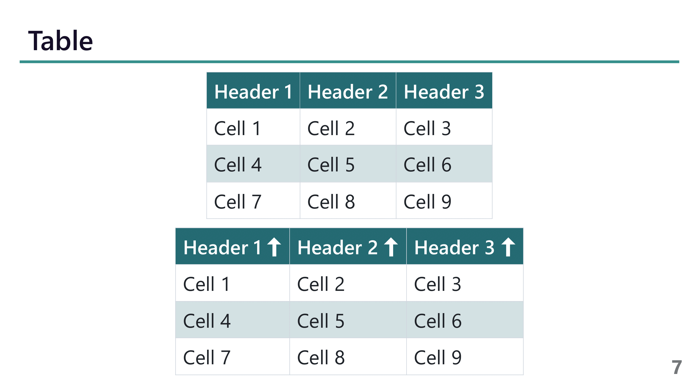

# marp-theme

my customized marp theme

## Usage

use `.vscode/settings.json` to set the theme

```json
{
  "markdown.marp.themes": [
    "https://raw.githubusercontent.com/kage1020/marp-theme/main/kage.css",
    "https://raw.githubusercontent.com/kage1020/marp-theme/main/kage-academic.css"
  ]
}
```

then, set frontmatter in markdown file

```markdown
---
marp: true
theme: kage
---
```

## Preview

### cover slide

```markdown
<!--
_class: cover
-->
```


### appendix slide

```markdown
---
_class: appendix
---
```


### default slide

```markdown
---
<!--
header: Title for Chapter
footer: Sub Title for Sub Chapter
paginate: true
-->
```


### with image alignment

#### centering

```markdown

```


#### right aligned

```markdown

```


### table

```markdown
| header1 | header2 | header3 |
| ------- | ------- | ------- |
| cell1   | cell2   | cell3   |
| cell4   | cell5   | cell6   |
| cell7   | cell8   | cell9   |
```




### Color code

```markdown
<code class="color" style="--color: red">red</code>
```


## Blockquote and Citation

```markdown
> Lorem ipsum dolor sit amet, consectetur adipiscing elit. Integer posuere erat a ante.
<cite class="center">Someone famous in Source Title</cite>
```


### arrow

```markdown
<p class="before-right-arrow">Lorem ipsum dolor sit, amet consectetur adipisicing elit. Atque eaque beatae quas facere ut blanditiis nisi sint laudantium, possimus nobis sed iste commodi praesentium eveniet assumenda porro esse omnis, repellat itaque totam, quisquam facilis voluptatem consequuntur corrupti! Tenetur distinctio atque quisquam nihil? Dignissimos quibusdam obcaecati nam odio consequatur recusandae ex.</p>
```


