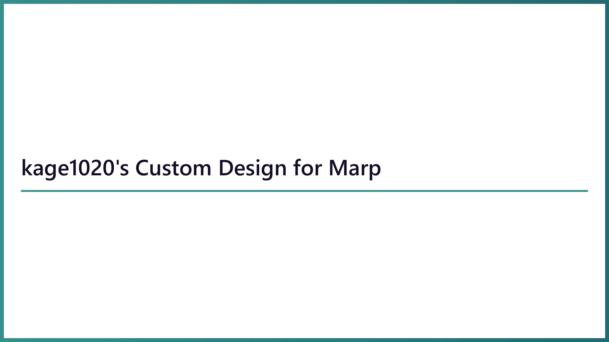

# marp-theme
my customized marp theme

## Usage

### custom color

```css
:root {
    --primary-color: #368F8B;
    --secondary-color: #160F29;
    --tertiary-color: #F3DFC1;
    --primary-dark-color: #246A73;
    --tertiary-dark-color: #DDBEA8;
}
```

### cover slide

```markdown
<!--
_class: cover
-->
```



### default slide

```markdown
---
<!--
header: Title for Chapter
footer: Sub Title for Sub Chapter
paginate: true
-->
```


### TODO slide (for WIP)

```markdown
---
<!--
header: Title for Chapter
footer: Sub Title for Sub Chapter
paginate: true
_class: todo
-->
```


### image alignment

#### centering

```markdown

```


#### right aligned

```markdown

```


### DOM display type

```css
.flex {
    display: flex;
    justify-content: center;
    align-items: center;
}

.grid {
    display: grid;
    place-items: center;
}

.grid-cols-4 {
    grid-template-columns: repeat(4, minmax(0, 1fr));
}
```

```markdown
<div class="flex">
    <ul>
        <li>Content 1</li>
        <li>Content 2</li>
        <li>Content 3</li>
    </ul>
    <ul>
        <li>Content 4</li>
        <li>Content 5</li>
        <li>Content 6</li>
    </ul>
</div>
```
